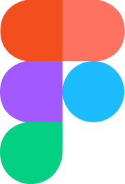
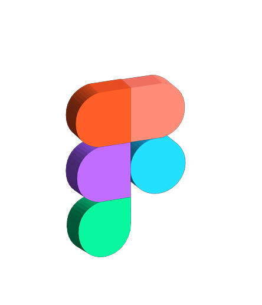
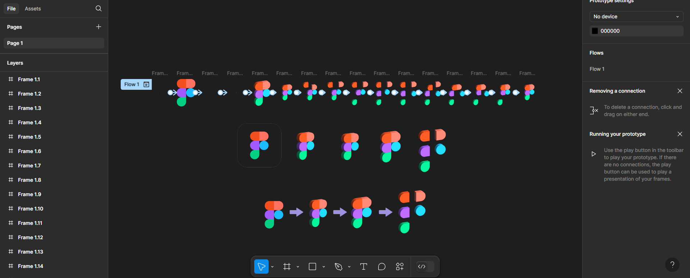
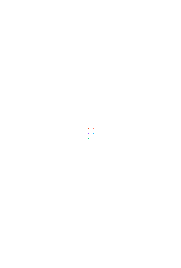

# Creation Logo Workshop 2  

## ПЗ-2 Робота з простими формами та їх властивостями у Figma. 

### Завдання:  
1. За керівництвом користувача Figma опрацювати розділи 3-6.  
2. Використовуючи просту форму (shape tool) **Rectangle**, створити зображення за прикріпленим зразком.  

---

## Хід роботи  

### 1. **Створення 2D-версії логотипу Figma**  
Спочатку я створив стандартний логотип Figma у 2D за допомогою базових форм.  

  

---

### 2. **Перетворення логотипу в суцільне 3D**  
Далі, використовуючи плагін **Fig3D**, я створив **єдину 3D-модель логотипу**, яка не була розділена на окремі частини.  

  

---

### 3. **Розділення логотипу на окремі 3D-форми в єдине лого**  
Щоб зробити ефект розпаду логотипу, я **поетапно прогнав кожну фігуру через Fig3D**, отримавши окремі 3D-елементи. Але з'єднав у єдине лого.  

  

---

### 4. **Відокремлення логотипу на окремі 3D-форми**  
Відокремив фігури, котрі отримав в минулому етапі, на окремі елементи.  

  

---

### 5. **Видалення фону**  
Використав плагін **Icons8 Background Remover**, щоб прибрати фон після конвертації в 3D.  

---

### 6. **Анімація логотипу**  
Я створив анімацію в **Figma**, використовуючи **Smart Animate**. Послідовність анімації:  
1. Спочатку з’являється **2D-версія** логотипу.  
2. Потім вона **переходить у 3D**.  
3. Далі логотип **перетворюється на набір окремих 3D-форм**.  
4. Після цього **елементи знову збираються** у повний логотип.  

Для різних переходів застосовані криві руху:  
- **Bouncy** (пружний ефект для розпаду логотипу).  
- **Slow** (плавний ефект для складання логотипу назад).  

  

---

### 7. **Процес створення лого та анімації**  

  

### 8. **Експорт фінальної GIF-анімації**  
Остаточну анімацію я експортував у формат GIF за допомогою плагіна **Export to GIF/Video**.  

  

---

## Висновок  
Я створив анімовану 2D та 3D-версію логотипу Figma, використовуючи базові форми, плагіни для 3D-конвертації та видалення фону. Також застосував **Smart Animate** у Figma з різними кривими руху (**Bouncy** та **Slow**) для створення плавних анімаційних переходів.  

Цей проєкт допоміг мені краще зрозуміти роботу з формами у Figma, принципи 3D-візуалізації та створення анімацій. 🚀  
